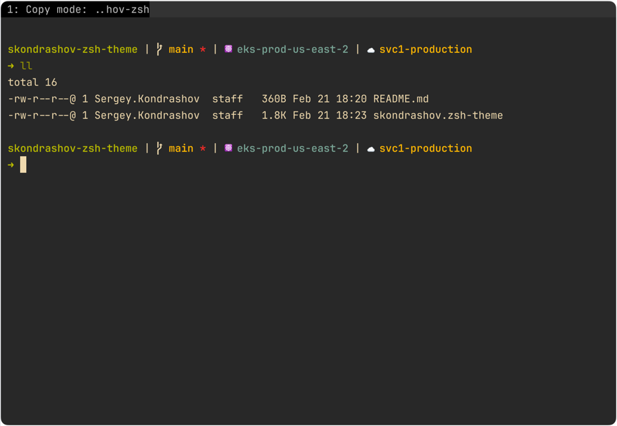

# skondrashov oh-my-zsh-theme

A minimalistic oh-my-zsh theme which displays only things I really need:
- some git info
- current Kubernetes context
- current AWS profile

And that's it for now.

### Installation
- `git clone --quiet https://github.com/sergkondr/skondrashov-zsh-theme ~/.oh-my-zsh/custom/themes/skondrashov`
- `ln -s ~/.oh-my-zsh/custom/themes/skondrashov/skondrashov.zsh-theme ~/.oh-my-zsh/custom/themes/skondrashov.zsh-theme`
- `omz theme set skondrashov`

### Preview 
Words are cheap, this is what it looks like:

